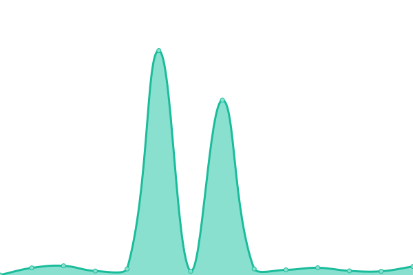

# [📈 Live Status](https://abpframework.github.io/abpio-status): <!--live status--> **🟩 All systems operational**

This repository contains the open-source uptime monitor and status page for [abp.io websites](https://abp.io/)

With [Upptime](https://upptime.js.org), you can get your own unlimited and free uptime monitor and status page, powered entirely by a GitHub repository. We use [Issues](https://github.com/abpframework/abpio-status/issues) as incident reports, [Actions](https://github.com/abpframework/abpio-status/actions) as uptime monitors, and [Pages](https://abpframework.github.io/abpio-status) for the status page.

<!--start: status pages-->
<!-- This summary is generated by Upptime (https://github.com/upptime/upptime) -->
<!-- Do not edit this manually, your changes will be overwritten -->
<!-- prettier-ignore -->
| URL | Status | History | Response Time | Uptime |
| --- | ------ | ------- | ------------- | ------ |
|  [abp.io](https://abp.io/health-status) | 🟩 Up | [abp-io.yml](https://github.com/abpframework/abpio-status/commits/HEAD/history/abp-io.yml) | 

 680ms
     
 | 

<a href="https://status.abp.io/history/abp-io">100.00%</a>
    

|  [community.abp.io](https://community.abp.io/health-status) | 🟩 Up | [community-abp-io.yml](https://github.com/abpframework/abpio-status/commits/HEAD/history/community-abp-io.yml) | 

 794ms
     
 | 

<a href="https://status.abp.io/history/community-abp-io">100.00%</a>
    

|  [commercial.abp.io](https://commercial.abp.io/health-status) | 🟩 Up | [commercial-abp-io.yml](https://github.com/abpframework/abpio-status/commits/HEAD/history/commercial-abp-io.yml) | 

 607ms
     
 | 

<a href="https://status.abp.io/history/commercial-abp-io">100.00%</a>
    

|  [nuget.abp.io](https://nuget.abp.io/health-status) | 🟩 Up | [nuget-abp-io.yml](https://github.com/abpframework/abpio-status/commits/HEAD/history/nuget-abp-io.yml) | 

 705ms
     
 | 

<a href="https://status.abp.io/history/nuget-abp-io">99.92%</a>
    

|  [docs.abp.io](https://docs.abp.io/health-status) | 🟩 Up | [docs-abp-io.yml](https://github.com/abpframework/abpio-status/commits/HEAD/history/docs-abp-io.yml) | 

 729ms
     
 | 

<a href="https://status.abp.io/history/docs-abp-io">100.00%</a>
    

|  [support.abp.io](https://support.abp.io/health-status) | 🟩 Up | [support-abp-io.yml](https://github.com/abpframework/abpio-status/commits/HEAD/history/support-abp-io.yml) | 

 688ms
     
 | 

<a href="https://status.abp.io/history/support-abp-io">100.00%</a>
    

|  [blog.abp.io](https://blog.abp.io/health-status) | 🟩 Up | [blog-abp-io.yml](https://github.com/abpframework/abpio-status/commits/HEAD/history/blog-abp-io.yml) | 

 591ms
     
 | 

<a href="https://status.abp.io/history/blog-abp-io">100.00%</a>
    

|  [commercial-demo.abp.io](https://commercial-demo.abp.io/health-status) | 🟩 Up | [commercial-demo-abp-io.yml](https://github.com/abpframework/abpio-status/commits/HEAD/history/commercial-demo-abp-io.yml) | 

 1128ms
     
 | 

<a href="https://status.abp.io/history/commercial-demo-abp-io">100.00%</a>
    

<!--end: status pages-->

[**Visit our status website →**](https://abpframework.github.io/abpio-status)

## 📄 License

- Powered by: [Upptime](https://github.com/upptime/upptime)
- Code: [MIT](./LICENSE) © [ABP](https://abp.io/)
- Data in the `./history` directory: [Open Database License](https://opendatacommons.org/licenses/odbl/1-0/)
